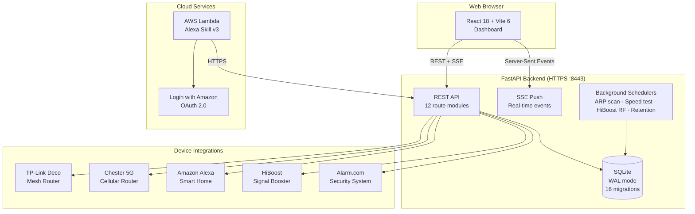
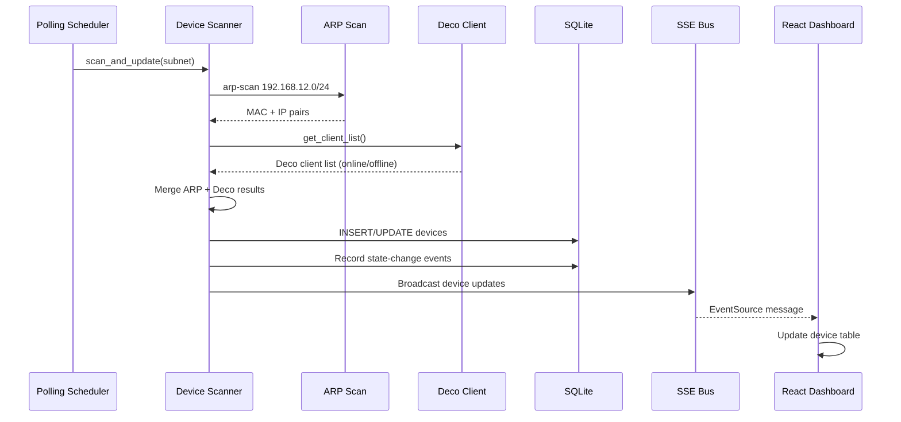
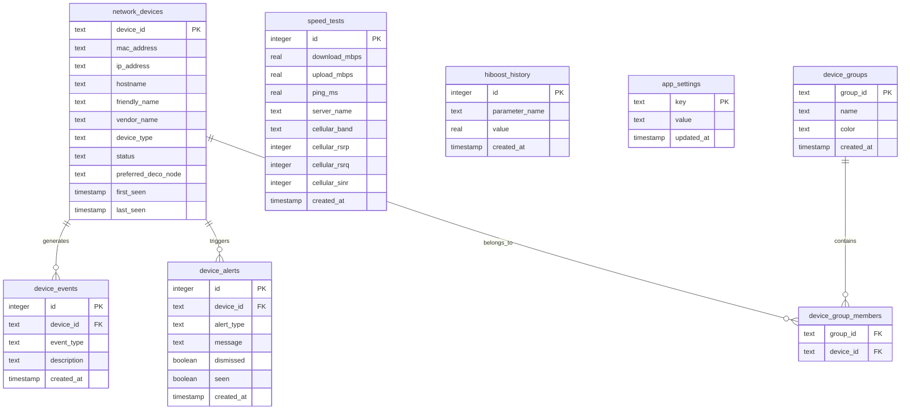

# HomeSentinel


A comprehensive home network monitoring and smart home management platform. HomeSentinel discovers devices on your LAN via ARP scanning, integrates with TP-Link Deco mesh routers, Chester 5G cellular routers, Amazon Alexa, HiBoost signal boosters, and Alarm.com security systems — all through a single React dashboard with real-time SSE updates.

## System Architecture



## Component Architecture

```mermaid
graph LR
    subgraph Frontend["Frontend (React 18)"]
        App["App.jsx"]
        Hook["useDevicePolling<br/>SSE + Multi-tier polling"]
        Pages["11 Pages"]
        Components["34+ Components"]
        App --> Hook
        App --> Pages
        Pages --> Components
    end

    subgraph Routes["Backend Routes (12)"]
        R1["devices · events · settings"]
        R2["deco · chester · alexa"]
        R3["hiboost · alarm_com · speedtest"]
        R4["sse · digest · health · oauth"]
    end

    subgraph Services["Backend Services (23)"]
        S1["device_scanner · event_service"]
        S2["deco_client · deco_service"]
        S3["chester_client · chester_service"]
        S4["alexa_client · alexa_service"]
        S5["hiboost_client · hiboost_service"]
        S6["alarm_com_client"]
        S7["speedtest_service · polling_service"]
        S8["correlation · oui · health · digest"]
        S9["retention_scheduler · hiboost_scheduler · speedtest_scheduler"]
    end

    subgraph Data["Data Layer"]
        DB2[("SQLite + WAL")]
        Fernet["Fernet Encryption<br/>Credentials at rest"]
    end

    Frontend -->|HTTPS| Routes
    Routes --> Services
    Services --> Data
```



## Device Discovery Flow



## Database Schema



## Technology Stack

### Backend
- **Runtime**: Python 3.9+
- **Framework**: FastAPI 0.104 with HTTPS (self-signed certs)
- **Database**: SQLite with WAL journal mode + write locking
- **Auth**: API key middleware (`X-API-Key`), OAuth 2.0 (Alexa account linking)
- **Encryption**: Fernet symmetric encryption for credentials at rest
- **Real-time**: Server-Sent Events (SSE) for push-based device updates

### Frontend
- **Framework**: React 18.2
- **Build Tool**: Vite 6.4
- **Styling**: Custom CSS with theme system (Deep Slate / Blue Steel)
- **Charts**: Recharts 3.8
- **Topology**: react-force-graph-2d (force-directed network graphs)
- **Data**: Custom `useDevicePolling` hook with multi-tier polling (15s/30s/60s) + SSE

### Infrastructure
- **Containerization**: Docker Compose (backend + frontend)
- **CI/CD**: GitHub Actions (Python 3.9/3.10/3.11 matrix)
- **Cloud**: AWS Lambda (Alexa Smart Home Skill v3)
- **HTTPS**: Auto-generated self-signed certificates

## Prerequisites

- Python 3.9 or higher
- Node.js 18+ and npm
- OpenSSL (for HTTPS certificate generation)
- `sshpass` + `speedtest-cli` on Chester router (for speed tests)
- Docker & Docker Compose (optional, for containerized deployment)

## Quick Start

### 1. Clone and initialize

```bash
git clone https://github.com/kennylhilljr/homesentinel.git
cd homesentinel
chmod +x init.sh
./init.sh
```

This will install Python/Node dependencies, generate SSL certificates, and start both servers.

### 2. Access the dashboard

| Service | URL |
|---------|-----|
| Frontend (dev) | http://localhost:2026 |
| Backend API | https://localhost:8443 |
| Health check | https://localhost:8443/api/health |

### Manual Setup

**Backend:**
```bash
cd backend
python -m venv venv
source venv/bin/activate
pip install -r requirements.txt
python main.py
```

**Frontend:**
```bash
cd frontend
npm install
npm start
```

### Docker

```bash
docker compose up -d
```

Backend runs on port 8443, frontend on port 2026.

## Integration Setup

### TP-Link Deco (Mesh Router)

```env
DECO_USERNAME=your_tp_link_email
DECO_PASSWORD=your_tp_link_password
DECO_MODE=cloud                          # "cloud" or "local"
# DECO_LOCAL_ENDPOINT=https://192.168.0.1  # local mode only
```

Provides: mesh node topology, per-node client mapping, WiFi band info (2.4G/5G/6G), QoS monitoring, node reboot.

### Amazon Alexa (Smart Home Skill)

```env
ALEXA_CLIENT_ID=amzn1.application-oa2-client.xxxxx
ALEXA_CLIENT_SECRET=amzn1.oa2-cs.v1.xxxxx
```

Provides: device discovery and state reporting, voice-controlled network monitoring via Alexa. The AWS Lambda function in `lambda/` implements the Alexa Smart Home Skill v3 API.

### Chester 5G Router (OpenWrt/ImmortalWrt)

```env
CHESTER_HOST=192.168.12.1
CHESTER_PORT=80
CHESTER_USERNAME=admin
CHESTER_PASSWORD=your_router_password
```

Provides: cellular signal metrics (RSRP, RSRQ, SINR), carrier aggregation info, WAN status, automated speed tests via SSH.

### HiBoost Signal Booster

Configure credentials via the Settings page in the dashboard. Provides: RF parameter monitoring (signal gain, isolation, output power) with 5-minute polling intervals and historical charts.

### Alarm.com Security System

```env
ALARM_COM_USERNAME=your_alarm_com_email
ALARM_COM_PASSWORD=your_alarm_com_password
```

Provides: partition status (armed/disarmed), sensor states, lock control, 2FA support with persisted cookies.

## Project Structure

```
homesentinel/
├── backend/
│   ├── main.py                    # FastAPI entry point, CORS, route mounting
│   ├── db.py                      # SQLite connection, WAL mode, migrations
│   ├── utils.py                   # MAC normalization, Fernet credential encryption
│   ├── requirements.txt           # Python dependencies
│   ├── routes/                    # API route modules (12 files)
│   │   ├── deco.py                #   /api/deco — mesh topology, nodes, WiFi
│   │   ├── chester.py             #   /api/chester — 5G router status
│   │   ├── alexa.py               #   /api/alexa — device discovery, control
│   │   ├── hiboost.py             #   /api/hiboost — signal booster RF data
│   │   ├── alarm_com.py           #   /api/alarm-com — security system
│   │   ├── speedtest.py           #   /api/speedtest — speed tests + insights
│   │   ├── settings.py            #   /api/settings — credential management
│   │   ├── events.py              #   /api/events — device events + alerts
│   │   ├── sse.py                 #   /api/sse — Server-Sent Events stream
│   │   ├── digest.py              #   /api/digest — daily summary stats
│   │   ├── health.py              #   /api/network — health score (0-100)
│   │   └── oauth.py               #   /oauth — Alexa account linking
│   ├── services/                  # Business logic (23 files)
│   │   ├── device_scanner.py      #   ARP-based network device discovery
│   │   ├── deco_client.py         #   TP-Link Deco encrypted API client
│   │   ├── chester_client.py      #   Chester JSON-RPC API client
│   │   ├── alexa_client.py        #   Login with Amazon OAuth client
│   │   ├── hiboost_client.py      #   HiBoost cloud API (SHA-256 + RSA)
│   │   ├── alarm_com_client.py    #   Alarm.com async API client
│   │   ├── oui_service.py         #   MAC vendor lookup (IEEE OUI database)
│   │   ├── correlation_service.py #   Cross-integration device correlation
│   │   ├── speedtest_service.py   #   SSH speedtest on Chester router
│   │   └── ...                    #   + schedulers, digest, health, retention
│   ├── middleware/
│   │   └── auth.py                # API key authentication middleware
│   ├── migrations/                # 16 sequential SQL migration files
│   ├── tests/                     # 20 pytest test files
│   └── certs/                     # Auto-generated SSL certificates
├── frontend/
│   ├── src/
│   │   ├── App.jsx                # Main app with theme + lazy page mounting
│   │   ├── hooks/
│   │   │   └── useDevicePolling.js  # SSE + multi-tier polling (15/30/60s)
│   │   ├── components/            # 34+ React components
│   │   │   ├── DeviceTable.jsx    #   Sortable device table with inline editing
│   │   │   ├── DecoTopologyView.jsx # Force-directed mesh topology graph
│   │   │   ├── StatusStrip.jsx    #   Real-time status indicators
│   │   │   └── ...
│   │   └── pages/                 # 11 page components
│   │       ├── DecoTopologyPage.jsx
│   │       ├── SpeedInsightsPage.jsx
│   │       ├── AlexaDevicesPage.jsx
│   │       ├── HiBoostPage.jsx
│   │       ├── AlarmComPage.jsx
│   │       ├── SmartHomePage.jsx
│   │       ├── SettingsPage.jsx
│   │       └── ...
│   ├── package.json
│   └── vite.config.js             # Port 2026, proxy /api to backend
├── lambda/
│   └── lambda_function.py         # Alexa Smart Home Skill v3 (AWS Lambda)
├── tests/
│   ├── deco-topology.spec.js      # Playwright E2E tests (18 scenarios)
│   └── integration_test.sh        # Backend integration test suite
├── scripts/
│   ├── gen-cert.sh                # SSL certificate generation with SANs
│   └── build-deploy.sh            # Production build and deploy
├── .github/workflows/
│   └── python-package.yml         # CI: lint + test on Python 3.9-3.11
├── docker-compose.yml             # Backend + frontend containers
├── init.sh                        # One-command project setup
├── start-dev.sh                   # Development server launcher
├── .env.example                   # Environment variable template
└── app_spec.txt                   # Original application specification
```

## Environment Variables

| Variable | Default | Description |
|----------|---------|-------------|
| `BACKEND_PORT` | `8443` | Backend HTTPS port |
| `CORS_ORIGINS` | `localhost:2026,localhost:8443` | Allowed CORS origins (comma-separated) |
| `HOMESENTINEL_API_KEY` | _(empty)_ | API key for `X-API-Key` auth (empty = auth disabled) |
| `OAUTH_CLIENT_SECRET` | _(required)_ | OAuth secret for Alexa account linking |
| `CREDENTIAL_KEY` | _(auto-generated)_ | Fernet key for credential encryption at rest |
| `NETWORK_SUBNET` | `192.168.12.0/24` | Subnet for ARP scanning |
| `POLLING_INTERVAL_SECONDS` | `60` | Device scan interval |
| `SPEEDTEST_INTERVAL_SECONDS` | `1800` | Speed test interval (30 min) |
| `HIBOOST_POLL_INTERVAL` | `300` | HiBoost RF polling interval (5 min) |
| `RETENTION_DAYS` | `90` | Event/alert data retention |
| `RETENTION_CLEANUP_HOUR` | `2` | Daily cleanup hour (0-23) |
| `DB_PATH` | `./backend/homesentinel.db` | SQLite database path |
| `LOG_LEVEL` | `INFO` | Logging level |

See `.env.example` for integration-specific variables (Deco, Alexa, Chester, Alarm.com).

## API Reference

### Core Endpoints

| Method | Endpoint | Description |
|--------|----------|-------------|
| `GET` | `/api/health` | Health check |
| `GET` | `/api/devices` | List all discovered devices |
| `GET` | `/api/devices/online` | Online devices only |
| `GET` | `/api/devices/search?q=` | Search by MAC, IP, hostname, vendor |
| `POST` | `/api/devices/scan-now` | Trigger manual ARP scan |
| `GET` | `/api/events?device_id=&event_type=` | Filtered event log |
| `GET` | `/api/events/alerts` | Active alerts |
| `GET` | `/api/sse/devices` | SSE stream for real-time updates |

### Integration Endpoints

| Method | Endpoint | Description |
|--------|----------|-------------|
| `GET` | `/api/deco/nodes` | Deco mesh node list |
| `GET` | `/api/deco/topology` | Mesh network topology |
| `GET` | `/api/chester/status` | Chester 5G router status |
| `GET` | `/api/alexa/devices` | Alexa device inventory |
| `GET` | `/api/hiboost/status` | HiBoost signal booster RF data |
| `GET` | `/api/alarm-com/status` | Alarm.com partition/sensor status |
| `POST` | `/api/speedtest/run` | Run speed test on Chester |
| `GET` | `/api/speedtest/history` | Speed test history + trends |
| `GET` | `/api/digest/daily` | Daily network digest |
| `GET` | `/api/network/health` | Composite health score (0-100) |

## Development

### Running Tests

```bash
# Backend unit tests
cd backend && pytest -v

# Backend with coverage
cd backend && pytest --cov=. --cov-report=term-missing

# Playwright E2E tests
npx playwright test tests/deco-topology.spec.js

# Integration tests
bash tests/integration_test.sh
```

### Building for Production

```bash
# Frontend production build
cd frontend && npm run build

# Serve everything from FastAPI (single port)
python backend/main.py
# React build is served from /static or /assets automatically
```

### Production Deployment

The backend automatically detects and serves a `frontend/build/` directory, enabling single-port deployment over HTTPS. After `npm run build`, the entire application runs on port 8443.

## Troubleshooting

### Port already in use

```bash
lsof -ti:8443 | xargs kill -9   # Backend
lsof -ti:2026 | xargs kill -9   # Frontend
```

### SSL certificate errors

Delete and regenerate certificates:
```bash
rm -rf backend/certs/
bash scripts/gen-cert.sh
```

### Deco API authentication fails

- Verify TP-Link credentials via the Tether mobile app
- Check `DECO_MODE` — use `cloud` unless accessing LuCI directly on LAN
- The local API uses RSA-encrypted passwords; see `backend/CLAUDE.md` for protocol details

### Speed tests not running

- Ensure `sshpass` and `speedtest` are installed on the Chester router
- Verify Chester SSH credentials in Settings page
- Check `SPEEDTEST_INTERVAL_SECONDS` (default: 1800s = 30 min)

### Database locked errors

The backend uses SQLite WAL mode with a Python threading lock for write serialization. If issues persist, check for zombie `python main.py` processes and kill them.

### Alexa Skill not discovering devices

1. Verify `OAUTH_CLIENT_SECRET` is set in `.env`
2. Confirm Lambda function URL matches Alexa Developer Console
3. Check Lambda CloudWatch logs for errors
4. Trigger "Discover Devices" from the Alexa app

## License

Proprietary - HomeSentinel Project
